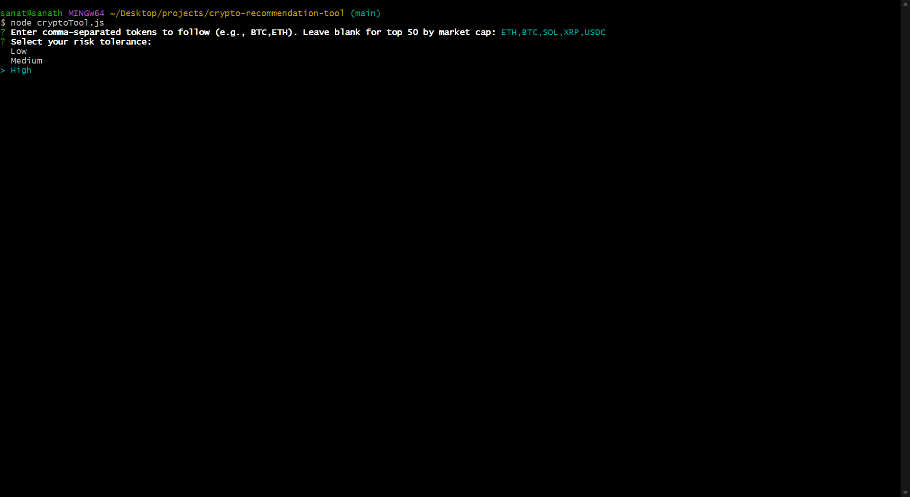
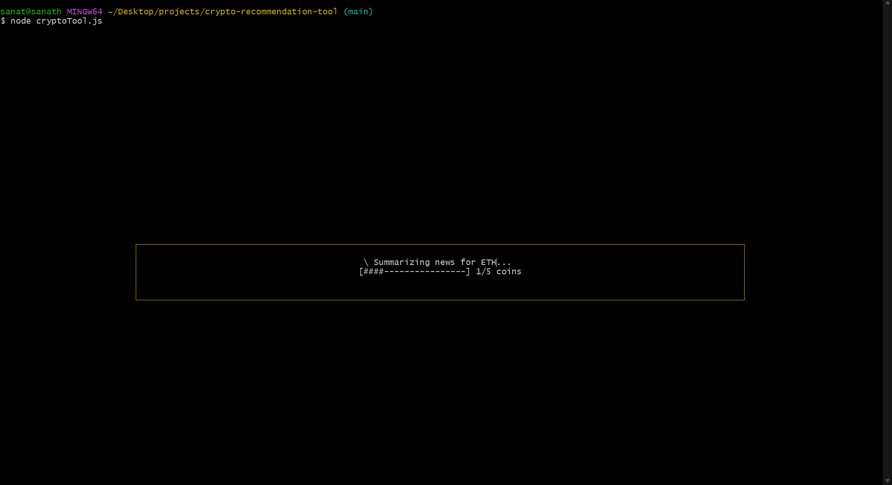
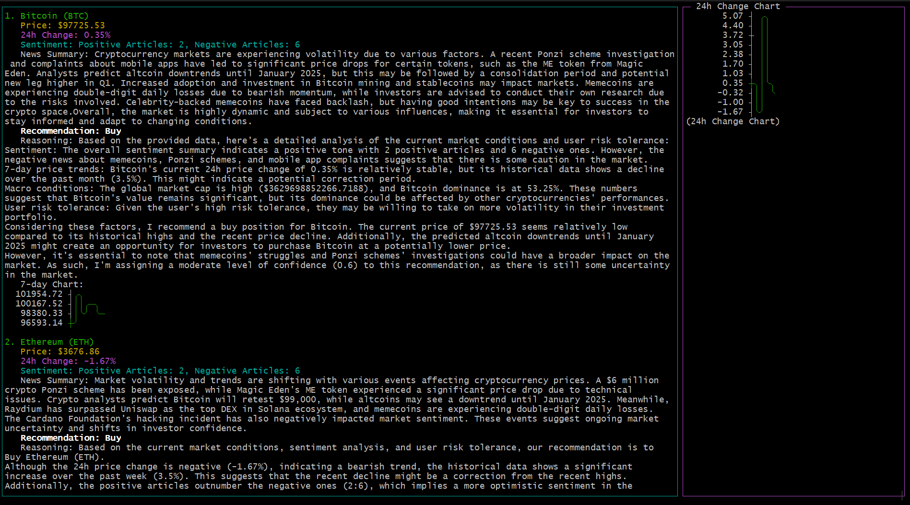

# Crypto Recommendation Tool

**Table of Contents**  
1. [Introduction](#introduction)  
2. [Features](#features)  
3. [Requirements](#requirements)  
4. [Installation & Setup](#installation--setup)  
   - [Install Ollama](#install-ollama)  
   - [Install Dependencies](#install-dependencies)  
   - [Set Up Environment Variables](#set-up-environment-variables)  
5. [Usage](#usage)  
6. [Interpreting Results](#interpreting-results)  
7. [Configuration](#configuration)  
8. [Screenshots](#screenshots)  
9. [Troubleshooting & Tips](#troubleshooting--tips)  
10. [License](#license)

---

## Introduction

The **Crypto Recommendation Tool** is an interactive CLI application that analyzes multiple cryptocurrencies, fetching real-time market data, relevant news, and performing sentiment analysis. It then uses a local Large Language Model (LLM) via [Ollama](https://ollama.com/) to provide buy/sell recommendations tailored to your risk tolerance.

## Features

- **Market Data Integration:** Real-time crypto market data retrieval including prices and percentage changes.
- **News & Sentiment Analysis:** Aggregates recent crypto news articles and evaluates sentiment.
- **LLM-Based Recommendations:** Uses a LLaMA-based model (via Ollama) to generate buy/sell recommendations and reasoning.
- **Historical Context & Global Data:** Displays short historical price trends and global market stats.
- **Customizable Inputs:** Choose which tokens to analyze and set your preferred risk level.
- **Interactive UI:** Built with `blessed`, displaying progress, charts, and results in an easy-to-navigate terminal interface.

## Requirements

- **Node.js:** Version 14+ recommended.
- **npm:** To install dependencies.
- **[Ollama](https://ollama.com/) installed:**  
  Tested with **Llama 3.2 3B** model. Should work with other LLaMA-based models by changing the `.env` config.

## Installation & Setup

### Install Ollama

Follow the instructions at [https://ollama.com/](https://ollama.com/) to install Ollama on your system.

Once installed, test it by running:
```bash
ollama list
ollama run llama3.2
```

### Install Dependencies

1. **Clone the repository:**
   ```bash
   git clone https://github.com/sanath1599/crypto-recommendation-tool.git
   cd crypto-recommendation-tool
   ```

2. **Install Node dependencies:**
   ```bash
   npm install
   ```

### Set Up Environment Variables

Copy and edit the `.env` file as necessary:

```bash
cp .env.example .env
```

Open `.env` and update the `LLAMA_MODEL` variable if you’re using a different model than `llama`:
```env
LLAMA_MODEL=llama
```

## Usage

Run the tool:
```bash
node cryptoTool.js
```

You’ll be prompted for:
- **Tokens to follow:** Comma-separated tokens (e.g., `BTC,ETH`) or leave blank for top 50 by market cap.
- **Risk tolerance:** Choose from `Low`, `Medium`, or `High`.

**Navigation:**
- Press `r` to re-run the analysis after completion.
- Press `q` or `Ctrl+C` to exit.

## Interpreting Results

After processing:
- **Market Data & Price Changes**
- **Sentiment Analysis:** Shows positive/negative article counts.
- **News Summaries:** Aggregated from crypto-related sources.
- **LLM Recommendations:** Buy/Sell suggestions and a confidence score, including reasoning.
- **Historical Data & Charts:** ASCII-based charts for quick trend overview.

**Example Flow:**
1. Start the program, input desired tokens and risk tolerance.
2. Wait while it fetches market data, news, and runs predictions.
3. Review the list of analyzed coins, sentiment summaries, and recommendations displayed in the terminal UI.

## Configuration

- **Model Name:** Set `LLAMA_MODEL` in `.env` (e.g., `llama`, `my-custom-llama-model`).
- **Max Coins:** Modify `MAX_COINS` in `cryptoTool.js` if you want to analyze more or fewer coins.
- **API Keys (if needed):** Place any API keys in `.env` as required by your data sources.

## Screenshots

**Initial Startup Prompt:**  


**Running Analysis and Generating Recommendations:**  


**Final Output with Recommendations:**  


## Troubleshooting & Tips

- **No Results Found:**  
  If no data is returned, the UI will show "No results found." Press `r` to retry with the same parameters.
  
- **Error Logs:**  
  Check `error.log` for runtime errors. It appends error messages with timestamps.
  
- **Performance Considerations:**  
  Analyzing multiple coins and articles may take time. Reduce the number of coins if it’s slow.
  
- **Changing Models:**  
  Make sure your chosen model is installed in Ollama and update `.env` accordingly.

## License

This project is licensed under the [MIT License](./LICENSE).

---

**Happy analyzing!**
```
